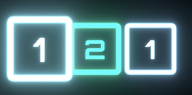
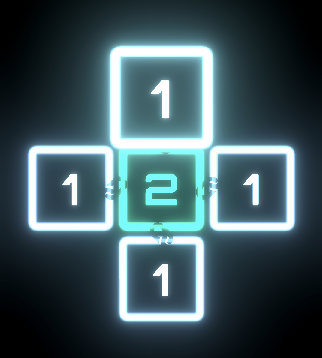
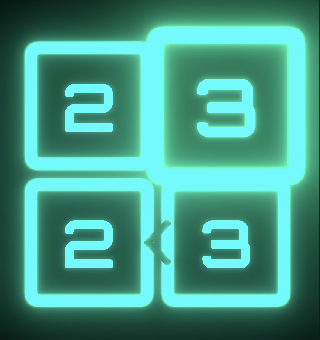
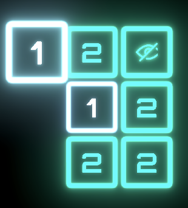
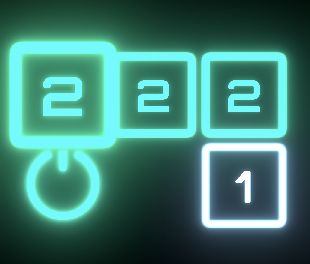
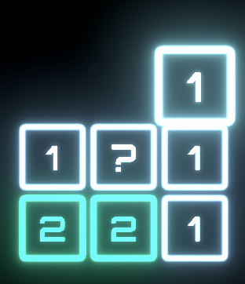
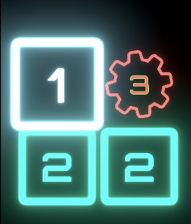
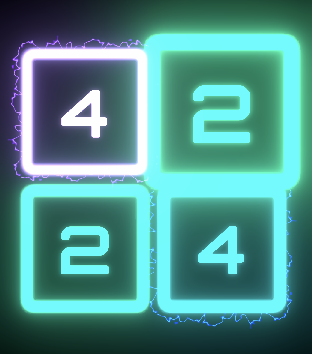

# 타일 디자인 상세 요청서

## 📌 타일 디자인 공통 필수 사항
* **중앙 숫자 표시:** 기본적으로 모든 타일의 정중앙에는 텍스트(숫자)가 들어갈 공간이 있어야 합니다.
* 게임 플레이 중 숫자가 계속 바뀌므로, 배경 이펙트나 아이콘이 화려하더라도 중앙의 숫자가 가장 또렷하게 보여야 합니다. (단, Blackout 등 일부 정보가 가려지는 타일은 숫자 대신 `?`나 숨김 아이콘이 들어갑니다.)

## 📌 타일별 상세 특징 (총 9종)

### 1. Normal (기본 타일)
* 가장 기본이 되는 네모난 네온 숫자 타일입니다.
* 숫자에 따라 색상이 변하므로(ex. 1: 하늘색, 2~3: 민트, 4 이상: 마젠타), 너무 화려하지 않고 특수 타일들을 돋보이게 해주는 깔끔한 기준 톤이어야 합니다.

### 2. CrossBlast (십자 폭발 타일)
* 상하좌우 4방향으로 에너지를 방출해 주변 타일에 영향을 주는 '전기 허브' 느낌입니다.
* 중앙에서 빛이 모이거나 십자(+) 방향으로 전류, 펄스가 뻗어나가는 형태가 보여야 합니다.

### 3. ShortCircuit (방향 제한 타일)
* 정해진 방향으로만 이동할 수 있는 타일입니다.
* 단순한 화살표 장식이 아니라, 기계적인 경고 표식이나 '전류가 강제로 흐르는 길'처럼 강한 방향성이 느껴져야 합니다.

### 4. Blackout (정보 숨김 타일)
* 숫자를 가리고 `?` 로 표시되는 타일입니다.
* 디지털 오류, 글리치(노이즈), 암전 등 정보가 손상되어 불안정하고 위험한 느낌이 나야 합니다.

### 5. Hidden (숨겨진 타일)
* 처음엔 비활성화되어 있다가 나중에 켜지는 타일입니다.
* 전원이 꺼진 슬롯, 유령 타일처럼 아주 희미하고 잠들어 있는 느낌을 주면 됩니다.

### 6. Igniter (점화/스위치 타일)
* 밟으면 'Hidden 타일'을 작동시키는 스위치입니다.
* 눌렀을 때 전원이 켜질 것 같은 물리적/기계적 장치 느낌이 나야 하며, 오렌지/앰버 계열의 따뜻한 작동 컬러가 들어가도 좋습니다.

### 7. BlindCurtain (블라인드 타일)
* 밟으면 보드 전체의 숫자를 가려버리는 룰의 시작점입니다.
* 눈가리개, 셔터, 차단막 등 시야를 가린다는 느낌의 마스킹 아이콘 형태면 좋겠습니다.

### 8. FixedKnot (순서 잠금 타일)
* 반드시 '특정 순서'에만 밟아야 하는 기계적 잠금장치 타일입니다.
* 톱니바퀴(기어)나 자물쇠 같은 외형에 중심에 숫자가 들어가서 "정확한 타이밍"을 요구하는 느낌이 나야 합니다.

### 9. TwinLink (동기화 짝궁 타일)
* 서로 떨어져 있어도 하나의 쌍으로 연결된 타일입니다.
* 같은 색상을 공유하며, 타일 테두리에 전기 흐름이나 번개 프레임 등이 있어 "둘이 시각적으로 세트"라는 느낌이 확실히 들어야 합니다.

